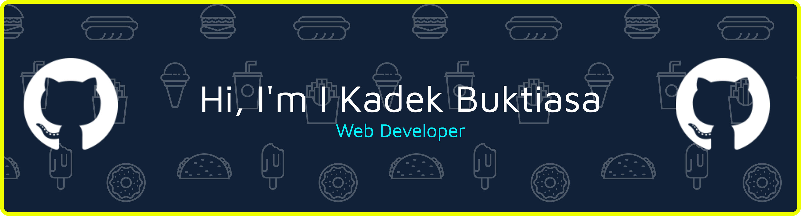

<br>

# I Kadek Buktiasa

**Frontend Developer · Bali, Indonesia**

> *"Curiosity is what got me started. Building is what keeps me going."*

I build web applications for real clients and real businesses — from UI to database. I've shipped production systems that are actively used today, mostly in the tourism and local business space in Bali.

I focus on understanding what a product needs to do before deciding how to build it. That means clean architecture, pragmatic decisions, and outcomes that hold up after launch.

<br>

---

### What I Build

```
→ Web Applications        Full-stack apps with real users and business logic
→ Local Business Tools    Websites + dashboards for SMEs and tourism businesses
→ Tourism Platforms       Bilingual, SEO-optimized sites for Bali-based businesses
→ Tools That Simplify     Systems that let non-technical owners manage their own content
```

---

### Selected Work

| Project | Description | Stack |
|---|---|---|
| **[Naraya Bali Tour](https://narayabalitour.com)** | Bilingual tourism website built during internship — tour packages, articles, responsive mobile design | Next.js · TypeScript · Tailwind · Vercel |
| **[Yoga's Bike Rental](https://yogasbikerental.com)** | Rental platform with owner dashboard, auth, and full CRUD — owner manages listings without touching code | Next.js · Supabase · TypeScript · Tailwind |
| **[Dewa Rental Ubud](https://dewarentalubud.com)** | Vehicle rental site (motorcycles + cars) with WhatsApp integration and SEO | Next.js · TypeScript · SEO · Tailwind |
| **[Cafein POS](https://www.cafein.fun)** | Point-of-sale web app — order management, inventory tracking, auth, real-time data | Next.js · Supabase · TypeScript · Tailwind |

---

### Tech Stack

**Frontend**


**Backend & Database**


**Tools & Deployment**


---

### GitHub Stats

<a href="https://github.com/ax71">
  
  
</a>

<br>


---

### Connect

[](https://www.linkedin.com/in/kadek-buktiasa/)
[](https://instagram.com/buktiasa__)
[](mailto:ikadekbuktiasa04@gmail.com)
[](https://ikadekbuktiasa.dev)

Open to remote work, freelance projects, and meaningful collaboration.

<br>

[](https://visitcount.itsvg.in)
